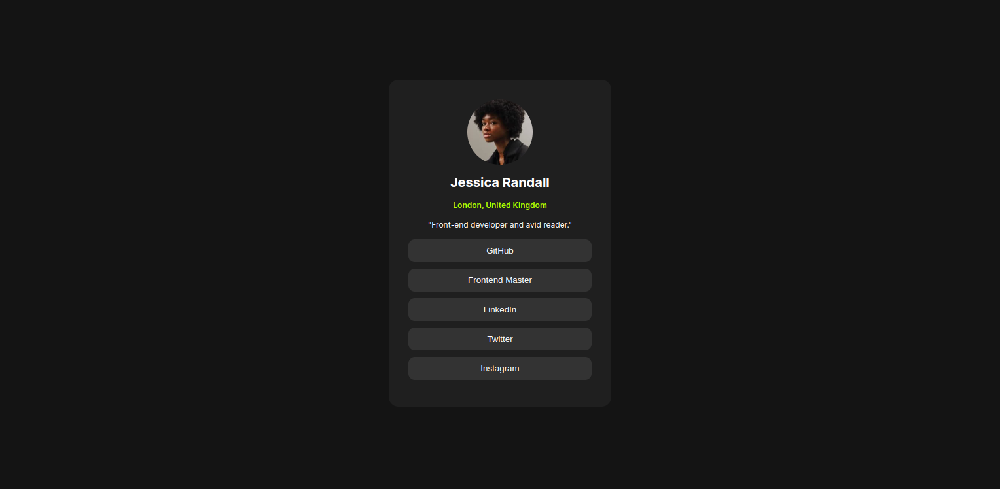

# Frontend Mentor - Social links profile

## Welcome! 👋

Social Links Profile
Welcome to the Social Links Profile project! This is a simple, responsive web page that displays a user's profile along with their social media links. The project is built using only HTML and CSS Flexbox.

Live Demo
Check out the live demo of the project: https://social-links-profile-psi-inky.vercel.app/.

Features
Responsive design that looks great on both desktop and mobile devices.
Simple and clean layout using CSS Flexbox.
Easy to customize and extend.

Getting Started
To get a local copy up and running, follow these simple steps.

Prerequisites
You will need a web browser to view the HTML file.

Installation
Clone the repo:
sh
Copy code
git clone https://github.com/simopoza/social-links-profile.git
Open the index.html file in your web browser to view the project.

Usage
Feel free to customize the HTML and CSS files to fit your needs. You can add more social links, change the styling, or even integrate with a backend to make it dynamic.

Built With
HTML
CSS Flexbox

Contributing
Contributions are what make the open-source community such an amazing place to learn, inspire, and create. Any contributions you make are greatly appreciated.

Fork the Project
Create your Feature Branch (git checkout -b feature/AmazingFeature)
Commit your Changes (git commit -m 'Add some AmazingFeature')
Push to the Branch (git push origin feature/AmazingFeature)
Open a Pull Request

License
Distributed under the MIT License. See LICENSE for more information.

Contact
Project Link: https://github.com/simopoza/social-links-profile
